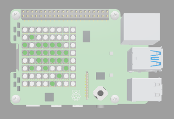

## Introduction

In this project, you will create a cute chameleon character that senses colour then changes to that colour. You will also sense humdity then display the reading in a graphic.

A chameleon is a type of lizard that has developed the ability to adapt its skin colour to its surroundings. They  have a long, curling tale to enable them to sit securely on tree branches. Humidity is important to chameleons. A chameleon needs the humidity of it's environment to be over 50% to remain healthy. 

You will:
+ Use the **colour** and **humidity sensors** on the SenseHAT
+ Use a **while loop** to continuously detect for sensor data changes
+ Use **if statements** to display images based on sensor data

--- no-print ---
--- task ---
### Click Run and try it

  
Change the colour sensor colour and the humidity values to see what happens to the chameleon and the water droplet.

<iframe src="https://trinket.io/embed/python/c387d50d68?outputOnly=true&runOption=run" width="600" height="600" frameborder="0" marginwidth="0" marginheight="0" allowfullscreen></iframe>

--- /task ---
--- /no-print ---

--- print-only ---

--- /print-only ---

You will need:
+ A web browser for the SenseHAT emulator

Optional:
+ A Raspberry Pi computer
+ A SenseHAT

[[[rpi-sensehat-attach]]]

**Tip**: The colour sensor is only available on the latest version of the SenseHAT. You can use the emulator as an alternative. 