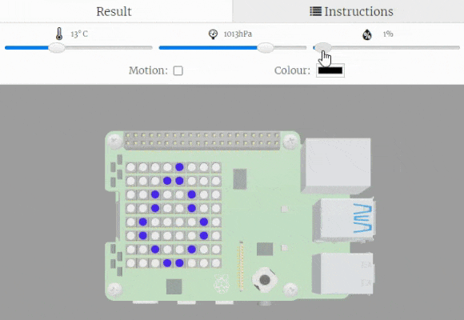

## Sense the humidity

In this step, you will detect the humidity using a sensor and display images on the LED Matrix to reflect the reading. 

{:width="300px"}

### Sense the humidity

The SenseHAT has a humidity sensor built into it. This means that you can take a reading from the sensor and produce some output on your LED Matrix to reflect the reading. 

You can use a `while` loop to continuously read data from the humidity sensor. 

--- task ---

Find the comment `# Display images based on humidity and colour sensor readings`.

Add in the code to start a `while` loop and then read data from the humidity sensor and store it in the `humidity` variable.

--- code ---
---
language: python
filename: main.py
line_numbers: true
line_number_start: 59
line_highlights: 61-63
---
# Display images based on humidity and colour sensor readings

while True: # Forever

  humidity = sense.get_humidity() # Take a reading from the humidity sensor
--- /code ---

--- /task ---

### Display the humidity reading

### Use a loop to repeatedly sense humidity