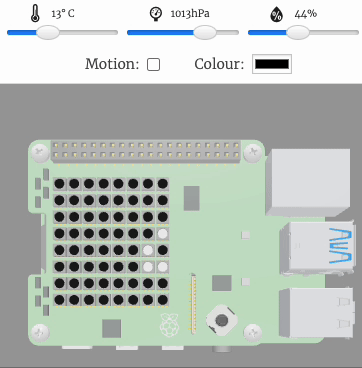
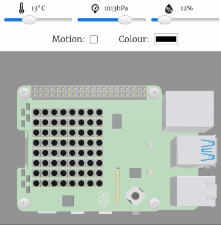
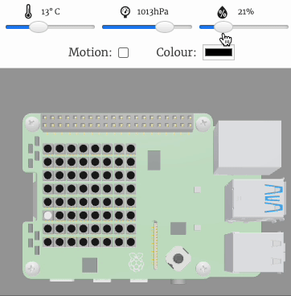

## Sense the humidity

In this step, you will detect the humidity using the humidity sensor then display the reading. 

{:width="300px"}

--- task ---

Open the [chameleon lights starter project](https://trinket.io/html/388a90e4b6){:target="_blank"}.

**Tip**: The code for setting up the SenseHAT has been entered for you.

--- collapse ---
---
title: Copying a starter project to run on your Raspberry Pi
---

Open the [starter project](https://trinket.io/html/388a90e4b6){:target="_blank"} as normal.

Click into the Trinket script editor and press `Ctrl + A` on the keyboard to select all the text. 

Press `Ctrl + C` to copy your selection.

Open a new window in Thonny on your Raspberry Pi.

Press `Ctrl + V` to paste your selection into the new Thonny window.

Save your work in Thonny by pressing `Ctrl + S` and entering a file name. 

--- /collapse ---

--- /task ---

Humidity is a measurement of how much water vapour there is in the air. 

### Sense the humidity

The SenseHAT has a humidity sensor built into it. This means that you can take a reading from the sensor and produce some output on your LED Matrix to reflect the reading. 

--- task ---

Create a variable called `humidity`. Get the humidity from the sensor then store it in the new variable: 

--- code ---
---
language: python
filename: main.py
line_numbers: true
line_number_start: 34
line_highlights: 36
---
# Display images based on humidity and colour sensor readings

humidity = sense.get_humidity() # Take a reading from the humidity sensor
--- /code ---

--- /task ---

### Display the humidity reading

--- task ---

Add code to display the humity reading as a scrolling text message on the LED matrix. 

The `str()` function converts the reading into a string of characters that can be displayed using `show_message`.

--- code ---
---
language: python
filename: main.py
line_numbers: true
line_number_start: 34
line_highlights: 37
---
# Display images based on humidity and colour sensor readings

humidity = sense.get_humidity() # Take a reading from the humidity sensor
sense.show_message(str(humidity)) # Display the reading from the humidity sensor
--- /code ---

--- /task ---

--- task ---

**Test:** your code by clicking on the Run button. The humidity value should be displayed in a scrolling message. Change the slider and run your code again to see the message change. 

**Debug:** Check your code matches the examples above. Make sure your brackets and commas are correct. 

{:width="300px"}

<mark>NEED AN INGREDIENT FOR TESTING HUMIDITY ON THE ACTUAL SENSEHAT!!!</mark>

--- /task ---

--- task ---

The humidity reading returns to 10 decimal places which is far more accurate than we need to see.

Change the humidity reading code so that the humity reading is only stored to one decimal place. 

--- code ---
---
language: python
filename: main.py
line_numbers: true
line_number_start: 34
line_highlights: 36
---
# Display images based on humidity and colour sensor readings

humidity = round(sense.get_humidity(),1) # Take a reading from the humidity sensor
sense.show_message(str(humidity)) # Display the reading from the humidity sensor
--- /code ---

--- /task ---

--- task ---

**Test:** your code by clicking on the Run button. The humidity value should be displayed to one decimal place only. 

**Debug:** Check your code matches the examples above. Make sure your brackets and commas are correct. 

{:width="300px"}

--- /task ---

### Use a loop to repeatedly sense humidity

You can use a `while` loop to continuously read data from the humidity sensor. 

--- task ---

Find the comment `# Display images based on humidity and colour sensor readings`.

Add code above the humidity lines of code to start a `while` loop. 

Use the Tab character on your keyboard before each line of humidity code to indent them. This will move them inside the `while` loop. 

--- code ---
---
language: python
filename: main.py
line_numbers: true
line_number_start: 34
line_highlights: 36-39
---
# Display images based on humidity and colour sensor readings

while True: # Forever

  humidity = round(sense.get_humidity(),1) # Take a reading from the humidity sensor
  sense.show_message(str(humidity)) # Display the reading from the humidity sensor
--- /code ---

--- /task ---

--- task ---

**Test:** your code by clicking on the Run button. Move the humidity slider, the message will change to show the humidty each time the sensor takes a reading. Move the slider again to see the message change. 

**Debug:** Check your code matches the examples above. Make sure your code is indented correctly. 

{:width="300px"}

--- /task ---

--- save ---