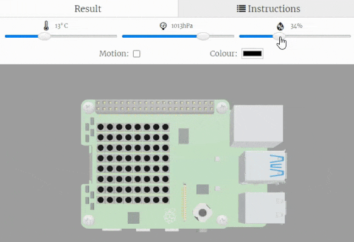
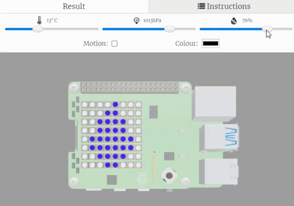

## Visualise the humidity

In this step, you will display images on the LED Matrix to reflect the humidity reading. 

{:width="300px"}

### Draw the water droplets

Images are often used to visually show data in a way that is quick for people to read. 

Your project is going to use a water droplet image to demonstrate the **humidity levels** in the environment. A full droplet means high humidity, an empty droplet means low humidity and a half filled droplet means medium humidity. 

--- task ---

Find the comment `# Colour palette`.

Enter the code to set up the variables in your colour palette.

--- code ---
---
language: python
filename: main.py
line_numbers: true
line_number_start: 14
line_highlights: 16-17
---
# Colour palette

w = (0, 0, 255) # Water drop colour
b = (255, 255, 255) # Background colour
--- /code ---

--- /task ---

--- task ---

Find the `# Humidity low` comment.

Create a list to represent a low humidity image. 

--- code ---
---
language: python
filename: main.py
line_numbers: true
line_number_start: 23
line_highlights: 25-33
---
# Humidity low

humidity_low = [
  b, b, b, b, w, b, b, b, 
  b, b, b, w, w, b, b, b, 
  b, b, w, b, b, w, b, b, 
  b, b, w, b, b, w, b, b, 
  b, w, b, b, b, b, w, b, 
  b, w, b, b, b, b, w, b, 
  b, b, w, b, b, w, b, b, 
  b, b, b, w, w, b, b, b]
--- /code ---

--- /task ---

--- task ---

Find the `# Humidity medium` comment.

Create a list to represent a medium humidity image.

--- code ---
---
language: python
filename: main.py
line_numbers: true
line_number_start: 35
line_highlights: 37-45
---
# Humidity medium

humidity_medium = [
  b, b, b, b, w, b, b, b, 
  b, b, b, w, w, b, b, b, 
  b, b, w, b, b, w, b, b, 
  b, b, w, b, b, w, b, b, 
  b, w, b, b, b, b, w, b, 
  b, w, w, w, w, w, w, b, 
  b, b, w, w, w, w, b, b, 
  b, b, b, w, w, b, b, b]
--- /code ---

--- /task ---

--- task ---

Find the `# Humidity high` comment.

Create a list to represent a high humidity image.

--- code ---
---
language: python
filename: main.py
line_numbers: true
line_number_start: 47
line_highlights: 49-57
---
# Humidity high

humidity_high = [
  b, b, b, b, w, b, b, b, 
  b, b, b, w, w, b, b, b, 
  b, b, w, w, w, w, b, b, 
  b, b, w, w, w, w, b, b, 
  b, w, w, w, w, w, w, b, 
  b, w, w, w, w, w, w, b, 
  b, b, w, w, w, w, b, b, 
  b, b, b, w, w, b, b, b]
--- /code ---

--- /task ---

--- task ---

Delete the line of code `sense.show_message(str(humidity))` as this is no longer needed.

--- code ---
---
language: python
filename: main.py
line_numbers: true
line_number_start: 59
line_highlights: 64
---
# Display images based on humidity and colour sensor readings

while True: # Forever

  humidity = round(sense.get_humidity(),1) # Take a reading from the humidity sensor
  
--- /code ---

--- /task ---

--- task ---

Underneath your code for reading the humidity sensor, add in code that will display the `humidity_high` image if the `humidity` is greater than `75`.

--- code ---
---
language: python
filename: main.py
line_numbers: true
line_number_start: 59
line_highlights: 64-65
---
# Display images based on humidity and colour sensor readings

while True: # Forever

  humidity = sense.get_humidity() # Take a reading from the humidity sensor
  if humidity > 75: # If the reading is higher than 75
    sense.set_pixels(humidity_high) # Display the humidity high image
--- /code ---

--- /task ---

--- task ---

**Test**: Click Run and test your code. Slide the humidity sensor value to above `75`, you should see your full water droplet image appear on the screen. 

**Debug:** Check your code matches the examples above. Make sure you have used  `>` and a `:` in your `if` statement. 

{:width="300px"}

--- /task ---

--- task ---

Underneath your `sense.set_pixels(humidity_high)` code, enter the code for checking if the `humidity` is less than `40`.

--- code ---
---
language: python
filename: main.py
line_numbers: true
line_number_start: 59
line_highlights: 66-67
---
# Display images based on humidity and colour sensor readings

while True: # Forever

  humidity = sense.get_humidity() # Take a reading from the humidity sensor
  if humidity > 75: # If the reading is higher than 75
    sense.set_pixels(humidity_high) # Display the humidity high image
  elif humidity < 40: # If the reading is less than 40
    sense.set_pixels(humidity_low)
--- /code ---

--- /task ---

--- task ---

**Test**: Click Run and test your code. You should see the empty water droplet appear when you slide the `humidity` value to below `40`. 

**Debug:** Check your code matches the examples above. Check that you have used colons `:` where needed.  

{:width="300px"}

--- /task ---

--- task ---

Underneath your `sense.set_pixels(humidity_low)` code, enter code to display an image for when the humidity **isn't** high or low.

--- code ---
---
language: python
filename: main.py
line_numbers: true
line_number_start: 59
line_highlights: 68-69
---
# Display images based on humidity and colour sensor readings

while True: # Forever

  humidity = sense.get_humidity() # Take a reading from the humidity sensor
  if humidity > 75: # If the reading is higher than 75
    sense.set_pixels(humidity_high) # Display the humidity high image
  elif humidity < 40: # If the reading is less than 40
    sense.set_pixels(humidity_low)
  else:
    sense.set_pixels(humidity_medium) # Display the medium humidity image
--- /code ---

--- /task ---

--- task ---

**Test**: Click Run and test your code. It should now display the `humidity_medium` image when the slider value is above 44 and below 76.

**Debug:** Check your code matches the examples above. Check that your angle brackets `<, >` are the correct way around. 

{:width="300px"}

--- /task ---

--- save ---