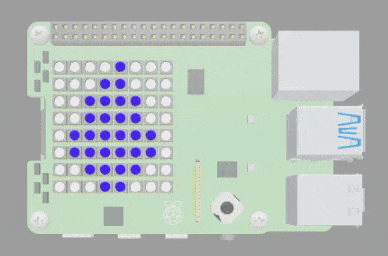

## Draw your chameleon

In this step, you will create a function to draw a green chameleon and display it on the LED matrix. 

{:width="300px"}

Functions are blocks of code designed for specific tasks. You can define your own functions and then your group of code can then be called whenver you want to reuse it.

### Create your chameleon function

--- task ---

Find the `# Chameleon` comment.

Enter the code `def chameleon():` to define your `chameleon` function. 

--- code ---
---
language: python
filename: main.py
line_numbers: true
line_number_start: 18
line_highlights: 19
---
# Chameleon
def chameleon():
--- /code ---

--- /task ---

--- task ---

Inside your `chameleon` function. Enter code to create a variable called `c` that will store the colour of the chameleon. 

Set the colour to green `(0, 255, 0)`.

--- code ---
---
language: python
filename: main.py
line_numbers: true
line_number_start: 18
line_highlights: 21
---
# Chameleon
def chameleon():
  
  c = (0, 255, 0) # Store the colour of the chameleon in the variable called c
--- /code ---

--- /task ---

--- task ---

Underneath the variable line of code, create a list to draw your chameleon and add a line of code to display the chameleon on the LED matrix. 

--- code ---
---
language: python
filename: main.py
line_numbers: true
line_number_start: 18
line_highlights: 23-33
---
# Chameleon
def chameleon():
  
  c = (0, 255, 0) # Store the colour of the chameleon in the variable called c

  image = [ 
    b, b, b, b, b, b, b, b, 
    b, c, b, b, b, b, b, b, 
    c, b, c, c, c, c, b, b, 
    c, c, c, c, c, c, c, b, 
    b, b, c, c, c, c, c, b, 
    b, c, b, c, b, b, c, b, 
    b, b, b, b, b, c, b, b, 
    b, b, b, b, c, b, b, b]

  sense.set_pixels(image)
--- /code ---

--- /task ---

--- task ---

Find your `while` loop and add a `sleep(1)` line of code to make sure that the humidity image displays for 1 second.

--- code ---
---
language: python
filename: main.py
line_numbers: true
line_number_start: 83
line_highlights: 93
---
# Display images based on humidity and colour sensor readings
while True: # Forever

  humidity = sense.get_humidity() # Take a reading from the humidity sensor
  if humidity > 75: # If the reading is higher than 75
    sense.set_pixels(humidity_high) # Display the humidity high image
  elif humidity < 40: # If the reading is less than 40
    sense.set_pixels(humidity_low)
  else:
    sense.set_pixels(humidity_medium) # Display the medium humidity image
  sleep(1)
--- /code ---

--- /task ---

--- task ---

Underneath the `sleep(1)` line of code and enter code that will call the chameleon on function. 

--- code ---
---
language: python
filename: main.py
line_numbers: true
line_number_start: 83
line_highlights: 94
---
# Display images based on humidity and colour sensor readings
while True: # Forever

  humidity = sense.get_humidity() # Take a reading from the humidity sensor
  if humidity > 75: # If the reading is higher than 75
    humidity_high() # Display the humidity high image
  elif humidity < 40: # If the reading is less than 40
    humidity_low() # Display the humidity low image
  else:
    humidity_medium() # Display the humidity medium image
  sleep(1)
  chameleon() # Draw the chameleon 
--- /code ---

--- /task ---

--- task ---

Add another `sleep(1)` to the bottom of your `while` loop to allow you to see the chameleon for 1 second.

--- code ---
---
language: python
filename: main.py
line_numbers: true
line_number_start: 94
line_highlights: 95
---
  chameleon() # Draw the chameleon
  sleep(1)
--- /code ---

--- /task ---

--- task ---

**Test**: Click Run and test your code. You should see your water droplet image, followed by a green chameleon image.

**Debug:** Check your code matches the examples above. Make sure your code is indented correctly. 

{:width="300px"}

--- /task ---

--- save ---