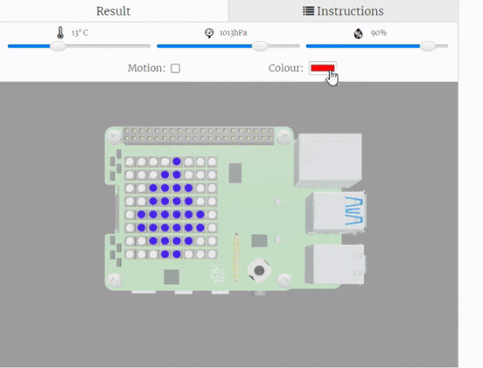

## Sense the colour

In this step, you will set up the colour sensor and use it to sense the colour in the environment. This colour will then be used to colour in your chameleon. 

{:width="300px"}

### Setup the colour sensor

--- task ---

Find the `# Set up the colour sensor` comment.

Enter the code to set up the colour sensor.

--- code ---
---
language: python
filename: main.py
line_numbers: true
line_number_start: 10
line_highlights: 12-13
---
# Set up the colour sensor

sense.color.gain = 60 # Set the sensitivity of the sensor
sense.color.integration_cycles = 64 # The interval at which the reading will be taken
--- /code ---

--- /task ---

### Use the colour sensor to colour in the chameleon

--- task ---

Go back to your `while` loop and find the line of code `sensed_colour = (0, 255, 0)`.

Above this line of code, enter two new lines of code that we take the reading from the colour sensor and store them.

**Tip**: Make room for your new lines of code by pressing the enter key.

--- code ---
---
language: python
filename: main.py
line_numbers: true
line_number_start: 76
line_highlights: 87-88
---
while True: # Forever

  humidity = sense.get_humidity() # Take a reading from the humidity sensor
  if humidity > 75: # If the reading is higher than 75
    sense.set_pixels(humidity_high) # Display the humidity high image
  elif humidity < 40: # If the reading is less than 40
    sense.set_pixels(humidity_low)
  else:
    sense.set_pixels(humidity_medium) # Display the medium humidity image
  sleep(1)
  
  sleep(2 * sense.colour.integration_time) # Sense the colour
  red, green, blue, clear = sense.colour.colour # Store the sensor readings
  sensed_colour = (0, 255, 0)
  sense.set_pixels(chameleon(sensed_colour)) # Draw the chameleon using the sense colour variable
  sleep(1)
--- /code ---

--- /task ---

You now have the actual readings from the colour sensor. These can now be stored in the `sensed_colour` variable to be used to draw the chameleon.

--- task ---

--- code ---
---
language: python
filename: main.py
line_numbers: true
line_number_start: 87
line_highlights: 89
---
  sleep(2 * sense.colour.integration_time) # Sense the colour
  red, green, blue, clear = sense.colour.colour # Store the sensor readings
  sensed_colour = (red, green, blue)
  sense.set_pixels(chameleon(sensed_colour)) # Draw the chameleon using the sense colour variable
  sleep(1)
--- /code ---

--- /task ---

--- task ---

**Test**: Click Run and test your code. You should be able to change the colour on the sensor and see your chameleon change. 

{:width="300px"}

<mark>How does this work with the physical sensehat? Do they stick some colour paper in front of it?</mark>

--- /task ---

--- save ---