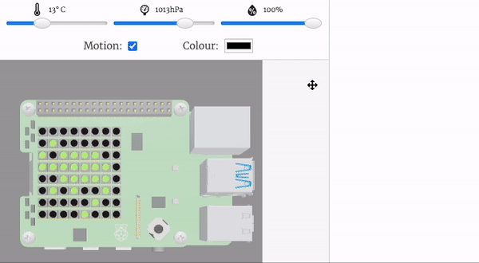
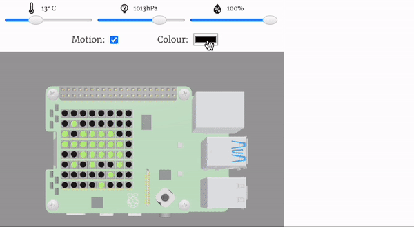
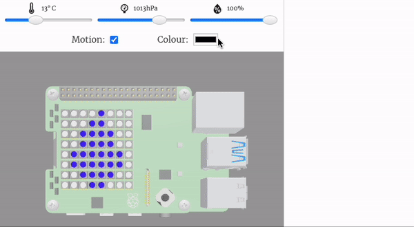

## Sense the colour

In this step, you will set up the colour sensor and use it to sense the colour in the environment. This colour will then be used to colour in your chameleon. 

{:width="300px"}

### Setup the colour sensor

--- task ---

Find the `# Setup the colour sensor` comment.

Enter the code to set up the colour sensor.

--- code ---
---
language: python
filename: main.py
line_numbers: true
line_number_start: 8
line_highlights: 9-10
---
# Set up the colour sensor
sense.color.gain = 60 # Set the sensitivity of the sensor
sense.color.integration_cycles = 64 # The interval at which the reading will be taken
--- /code ---

--- /task ---

### Use the colour sensor to colour your background

--- task ---

Go to your `chameleon()` function and add code to store and use the sensed colour as the background colour.

**Tip**: Make room for your new line of code by pressing the enter key.

--- code ---
---
language: python
filename: main.py
line_numbers: true
line_number_start: 19
line_highlights: 24-25
---
# Chameleon
def chameleon():
  
  c = (0, 255, 0) # Store the colour of the chameleon in the variable called c

  b = sense.colour.colour[0:3] # Store the sensed_colour value in the variable called c
  red, green, blue = sense.colour.colour[0:3]

  image = [ 
    b, b, b, b, b, b, b, b, 
--- /code ---

--- /task ---

--- task ---

**Test**: Click Run and test your code. You should be able to change the colour on the sensor and see the background colour change. 

**Debug:** Check your code matches the examples above. 

{:width="300px"}

[[[detect-colour-sensehat]]]

--- /task ---

### Make the chameleon adapt to its environment

--- task ---

Underneath the code to sense the background colour. Enter an `if` statement that will detect if the colour sensed has more **red** tones. If it is, it will change the chameleon to the colour red. 

--- code ---
---
language: python
filename: main.py
line_numbers: true
line_number_start: 19
line_highlights: 27-28
---
# Chameleon
def chameleon():
  
  c = (0, 255, 0) # Store the colour of the chameleon in the variable called c
  
  b = sense.colour.colour[0:3] # Store the sensed_colour value in the variable called c
  red, green, blue = sense.colour.colour[0:3]
  
  if red > green and red > blue:
    c = (255, 0, 0)
--- /code ---

--- /task ---

--- task ---

**Test**: Click Run and test your code. The default colour of your chameleon should be green. If you change the colour sensed to a red tone then the chameleon should change colour to red. 

{:width="300px"}

--- /task ---

--- task ---

Now add in **two** `elif`s to change for green and blue tones. If it detects them then the chameleon will change colour. 

--- code ---
---
language: python
filename: main.py
line_numbers: true
line_number_start: 19
line_highlights: 29-32
---
# Chameleon
def chameleon():
  
  c = (0, 255, 0) # Store the colour of the chameleon in the variable called c
  
  b = sense.colour.colour[0:3] # Store the sensed_colour value in the variable called c
  red, green, blue = sense.colour.colour[0:3]
  
  if red > green and red > blue:
    c = (255, 0, 0)
  elif green > red and green > blue:
    c = (0, 255, 0)
  elif blue > green and blue > red:
    c = (0, 0, 255)
--- /code ---

--- /task ---

--- task ---

**Test**: Click Run and test your code. Now if you change your sensed colour to a green tone, the chameleon should turn green. If you change the sensed colour to a blue tone then the chameleon should turn blue. 

{:width="300px"}

--- /task ---

--- save ---